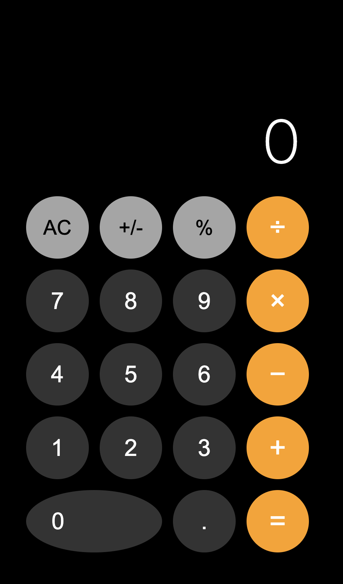

# MagicCalc - 魔术计算器

一个高度还原 iOS 风格的计算器应用，内置精妙的魔术流程，让观众体验数字预测的神奇效果。



## 🎯 魔术玩法

### 准备工作
1. 打开浏览器访问 `index.html`
2. 将计算器交给观众操作

### 魔术流程

**第一步**：请第一位观众输入一个 **4 位数**，然后按 `+`

> 例如：输入 `1234`，按 `+`

**第二步**：请第二位观众输入一个 **5 位数**，然后按 `+`

> 例如：输入 `56789`，按 `+`
>
> 此时屏幕会显示：`58023`（1234 + 56789 的和）

**第三步**：请第三位观众背对屏幕，随意输入一个 **6 位数**

> 观众每输入一位数字，当他输完第 6 位时...
>
> **神奇时刻**：让他转过身来，屏幕上显示的**不是**他输入的数字，而是一个神秘的"魔法数字"！

**第四步**：让观众按 `=` 键

> 屏幕上显示出**当前时间 + 10 秒**的月份、日期、时、分
>
> 例如：`02161250` = 2月16日 12:50

## 🔮 魔术原理

### 核心数学逻辑

整个魔术基于一个简单的代数恒等式：

```
Target = Num1 + Num2 + (Target - Num1 - Num2)
```

其中：
- `Num1`：第一位观众输入的 4 位数
- `Num2`：第二位观众输入的 5 位数
- `Target`：当前时间 + 10 秒（MMDDHHmm 格式）

### 实现步骤

1. **记录阶段**：
   - 第一次按 `+`：记录 Num1
   - 第二次按 `+`：记录 Num2，计算并显示 `Num1 + Num2`

2. **魔法数字生成**：
   - 当第三位观众输完 6 位数时，程序获取当前系统时间
   - 计算 `Target = 当前时间 + 10 秒`（格式化为 MMDDHHmm）
   - 计算魔法数字：`MagicNum = Target - Num1 - Num2`
   - 屏幕立即显示 MagicNum（覆盖观众输入的 6 位数）

3. **最终呈现**：
   - 观众按 `=` 后，程序计算：`Num1 + Num2 + MagicNum`
   - 结果 = `Num1 + Num2 + (Target - Num1 - Num2)` = `Target`

### 为什么观众看不出破绽？

- 观众输数字时背对屏幕，看不到自己输入的数字
- 转过身时，屏幕上显示的是计算出的"魔法数字"
- 观众以为那是他自己输入的数字
- 最后按 `=` 得到"预测的时间"，效果震撼

## 💻 技术实现

### 状态机设计

```
NORMAL_MODE (0)          // 正常计算模式
    ↓ 输入4位数，按 +

MAGIC_STAGE_1 (1)        // 已记录 Num1
    ↓ 输入5位数，按 +

MAGIC_STAGE_2 (2)        // 已记录 Num2，显示和
    ↓ 输入6位数

MAGIC_STAGE_3 (3)        // 已记录 Num3，显示魔法数字
    ↓ 按 =

FINAL_REVEAL (4)         // 显示最终结果
```

### 关键函数

- `getTargetTime()`: 获取当前时间 + 10 秒，格式化为 MMDDHHmm
- `handleNumberClick()`: 检测输入位数，自动触发魔术流程
- `handleOperatorClick()`: 处理加法，记录观众输入的数字
- `handleEqualsClick()`: 显示最终预测结果

### 特性

- ✅ 高度还原 iOS 深色模式 UI
- ✅ 单文件 HTML，无需任何依赖
- ✅ 响应式设计，支持移动端
- ✅ 完整的键盘支持
- ✅ 右上角魔术指示灯（呼吸灯效果）
- ✅ 调试模式（双击 AC 开启）

## 🎮 调试模式

双击 `AC` 按钮可开启/关闭调试面板，查看：
- 当前状态
- 已记录的 Num1、Num2、Num3
- Target 值
- 计算器内部状态

## 🚀 运行项目

```bash
# 方式一：直接双击 index.html

# 方式二：使用本地服务器
python3 -m http.server 8000
# 访问 http://localhost:8000

# 方式三：VS Code Live Server
# 右键 index.html → Open with Live Server
```

## 📝 注意事项

- 魔术流程只能使用 `+` 运算符
- 如果输入的数字位数不对（非4位/5位/6位），会自动退出魔术模式
- 非魔术流程下，计算器可正常使用所有功能
- 时间格式为 MMDDHHmm（8位数字），不包含年份

## 🎭 表演建议

1. **时机选择**：选择一个容易记住的时间点（如整点、半点）
2. **观众选择**：找三位互不认识的观众，增强效果
3. **台词设计**："现在屏幕上显示的数字，其实已经预测了一分钟后的时间..."
4. **高潮呈现**：让观众自己按 `=` 键，增加参与感

## 📜 许可证

MIT License

---

**享受魔术带来的惊喜！** 🎩✨
